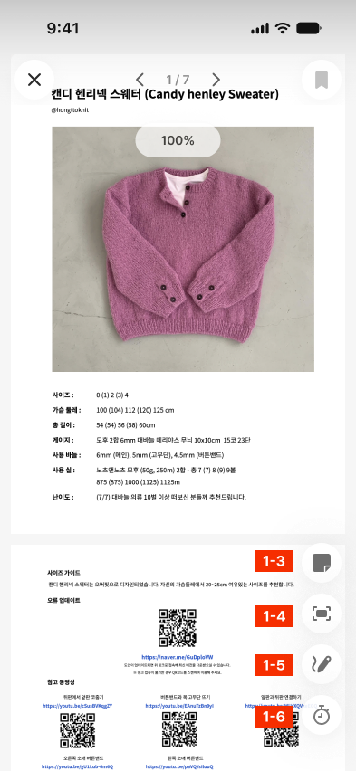
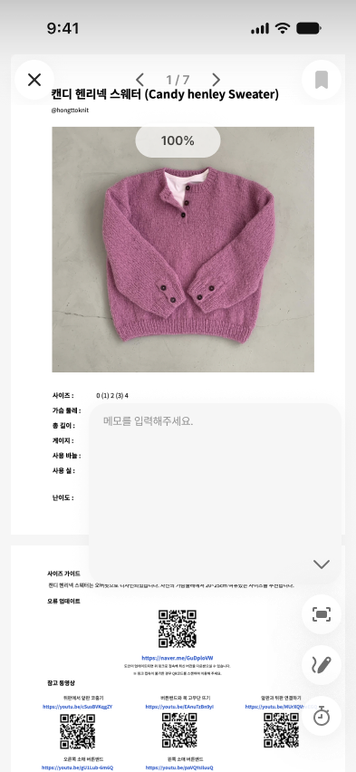
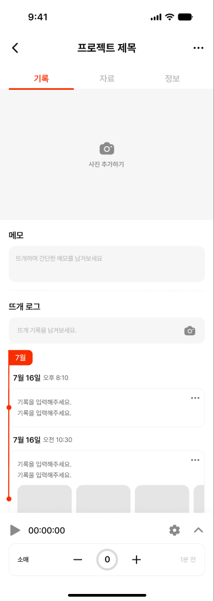

# [작업 요청] PDF 뷰어 메모 기능 추가

> 작성일: 2026-10-05

---

## 1. 배경 및 목적

뜨개를 하면서 도안 PDF를 보다가 "몇 단까지 떴는지", "사이즈 3 기준 코 수" 같은 메모를 바로 남기고 싶다는 니즈가 있어요.
지금은 메모를 남기려면 PDF 뷰어를 닫고 기록 화면으로 돌아가야 해요.
그래서 **PDF 뷰어 우측 하단 플로팅 버튼 영역에 '메모' 버튼을 추가하고, 누르면 도안 위에 메모 입력창이 뜨도록** 하려고 해요.

---

## 2. 참고 디자인 (Figma)

| 화면 | 링크 | 스크린샷 |
|---|---|---|
| 기록_PDF 뷰어 (기본) | [node 5932-43695](https://www.figma.com/design/z6EFgx2NXyWofDE6pJNoTe/Knitters-App?node-id=5932-43695) |  |
| 기록_PDF 뷰어 (메모) | [node 7782-60118](https://www.figma.com/design/z6EFgx2NXyWofDE6pJNoTe/Knitters-App?node-id=7782-60118) |  |
| 기록_기록 (메모 연동) | [node 7603-63399](https://www.figma.com/design/z6EFgx2NXyWofDE6pJNoTe/Knitters-App?node-id=7603-63399) |  |

- 기본 화면 우측 하단 버튼 스택의 맨 위 버튼이 이번에 새로 추가하는 **메모 버튼**이에요.

---

## 3. 요구사항

### 3-1. 우측 하단 버튼에 메모 버튼 추가 — [기록_PDF 뷰어]

- 우측 하단 플로팅 버튼 스택의 **맨 위**에 메모 버튼을 추가해요.
  - 버튼 순서(위 → 아래): **메모** / 너비 맞춤(Fit Width) / 마크업(Markup) / 카운터(Bottom Counter)
- 버튼 스펙은 기존 플로팅 버튼과 같아요.

| 항목 | 값 |
|---|---|
| 크기 | 44 × 44px, 원형 (`rounded-full`) |
| 배경 | `#FFFFFF`, opacity 90% |
| 그림자 | `0 4px 20px 1px rgba(23,23,23,0.04)` + `0 0 30px rgba(23,23,23,0.1)` |
| 아이콘 | `Icon/Normal/Memo` 24 × 24px, 색상 `#5E5E5E` (Semantic/Label/Neutral) — Figma에서 SVG로 내보내 인라인 SVG로 사용 |
| 버튼 간격 | 12px (세로 스택) |
| 위치 | 화면 우측 16px, 스택 하단이 화면 하단에서 40px |

### 3-2. 메모 버튼 탭 → 메모 입력창 표시 — [기록_PDF 뷰어 (메모)]

- 메모 버튼을 누르면 **메모 버튼 자리에 메모 입력창이 펼쳐져요.**
  - 메모 입력창이 열려 있는 동안에는 메모 버튼이 사라지고, 나머지 3개 버튼(너비 맞춤 / 마크업 / 카운터)만 남아요.
  - 입력창은 남은 버튼 스택 바로 위(간격 약 12px)에 두고, 오른쪽 끝을 버튼과 맞춰요.
- 입력창 스펙

| 항목 | 값 |
|---|---|
| 크기 | 279 × 200px (393px 기준 화면, 좌 98px / 우 16px 여백) |
| 배경 | `#F6F6F6` (Semantic/Background/Input) |
| 모서리 | 20px |
| 그림자 | `0 4px 20px 1px rgba(23,23,23,0.04)` |
| 안쪽 여백 | 좌우 16px, 상하 10px |
| 텍스트 | Pretendard Regular 12px / line-height 20px, 입력 텍스트 색 `#5E5E5E` |
| 플레이스홀더 | "메모를 입력해주세요." / 색상 `#8A8A8A` (Semantic/Label/Alternative) |
| 닫기 버튼 | `Icon/Normal/Chevron Down` 24 × 24px, 색상 `#5E5E5E`, opacity 90% / 입력창 우측 하단 (오른쪽·아래 10px 여백) |

- 동작
  - 입력창은 여러 줄을 입력할 수 있는 `textarea`로 만들어요. 내용이 높이를 넘으면 입력창 안에서 스크롤돼요.
  - 입력창이 열릴 때는 **자동으로 포커스가 가지 않고, 키보드도 올라오지 않아요.** 메모를 보기만 하려고 버튼을 누를 수도 있기 때문이에요.
    - 사용자가 입력창 안을 직접 탭했을 때만 포커스가 가고 키보드가 올라와요.
  - 입력창은 아래 두 가지 방법으로 닫을 수 있고, 닫히면 메모 버튼이 다시 나타나요.
    1. 입력창 우측 하단의 **Chevron Down 아이콘을 탭**
    2. 입력창 **바깥 영역(PDF 등)을 탭**
  - 닫을 때 키보드도 함께 내려가요(`blur`).
  - Chevron Down 아이콘의 터치 영역은 아이콘보다 넓게(최소 44 × 44px) 잡아요.
  - 입력한 글자가 아이콘에 가려지지 않도록 `textarea` 아래쪽에 아이콘 높이만큼 여백을 둬요.
  - 바깥 영역을 탭하면 입력창만 닫히고, 그 탭이 다른 동작(다른 플로팅 버튼 실행, 상단 버튼 등)으로 이어지지 않게 해요.
  - 키보드가 올라와도 입력창이 키보드에 가려지지 않아야 해요 (`visualViewport` 기준으로 위치 보정).
  - 열고 닫을 때 짧은 fade + scale 애니메이션을 넣어요 (기존 시트의 `cubic-bezier(0.32, 0.72, 0, 1)` 이징 재사용).

### 3-3. 메모 저장 및 [기록_기록] 페이지 연동

- 메모는 **프로젝트(기록) 단위로 1개**를 저장해요. (페이지별 메모는 이번 범위가 아니에요)
- PDF 뷰어 메모는 **[기록_기록] 페이지의 메모 영역과 같은 데이터**예요.
  - PDF 뷰어에서 입력한 메모는 자동으로 저장되고, [기록_기록] 페이지의 메모 영역에도 그대로 보여요.
  - 반대로 [기록_기록] 페이지에서 메모를 수정하면, PDF 뷰어 메모 입력창에도 수정된 내용이 보여요.
  - 별도의 저장 버튼 없이 입력하는 대로 저장돼요.
- 저장 방식
  - `Project` 타입에 메모 필드를 하나 추가하고(예: `memo?: string`), 두 화면이 같은 필드를 읽고 써요.
  - 입력 중에는 debounce(약 500ms)로 `updateProject(id, { memo })`를 호출하고, zustand `persist`로 로컬에 저장해요.
  - PDF 뷰어나 기록 페이지를 다시 열어도 이전 메모가 그대로 보여야 해요.
- 메모가 저장되어 있어도 메모 버튼 아이콘 색상은 바뀌지 않아요. 항상 기본 색상 `#5E5E5E`를 유지해요.
- PDF를 변경하거나 삭제해도 메모는 유지돼요.

---

## 4. 완료 조건 (Acceptance Criteria)

- [ ] PDF가 등록된 상태에서 뷰어를 열면 우측 하단에 메모 버튼이 Figma와 같은 위치·모양으로 보여요.
- [ ] 메모 버튼을 누르면 메모 버튼이 사라지고 279 × 200 메모 입력창이 나타나요. 이때 키보드는 올라오지 않아요.
- [ ] 입력창 안을 탭하면 그때 키보드가 올라오고 바로 입력할 수 있어요.
- [ ] 비어 있을 때 "메모를 입력해주세요." 플레이스홀더가 보여요.
- [ ] 입력창 우측 하단의 Chevron Down 아이콘을 탭하면 입력창이 닫히고 메모 버튼이 다시 보여요.
- [ ] 입력창 바깥 영역을 탭해도 입력창이 닫히고 메모 버튼이 다시 보여요.
- [ ] PDF 뷰어에서 입력한 메모가 [기록_기록] 페이지 메모 영역에 자동으로 보이고, 반대 방향도 똑같이 반영돼요.
- [ ] 메모를 입력하고 뷰어를 닫았다가 다시 열거나 앱을 새로고침해도 메모가 유지돼요.
- [ ] iOS Safari / Android Chrome에서 키보드가 올라와도 입력창이 가려지지 않아요.
- [ ] `npm run build`(타입 체크 포함)가 통과해요.

---

## 5. 확인 필요 사항 (디자인/기획)

1. **메모 단위**: 프로젝트당 1개로 가정했어요. 페이지별 메모가 필요한지 확인이 필요해요.
2. **글자 수 제한**: 제한이 있다면 몇 자인지 알려주세요 (가정: 제한 없음).
3. Figma 메모 입력창 레이어 안의 `Chevron Right` 아이콘(x=329)은 입력창 폭(279) 밖에 있어 화면에 보이지 않아요. 사용하지 않는 레이어로 보고 구현하지 않을 예정이에요. 의도된 요소라면 알려주세요.
